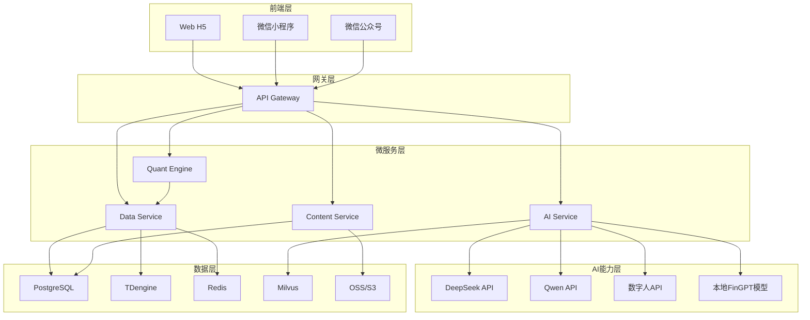
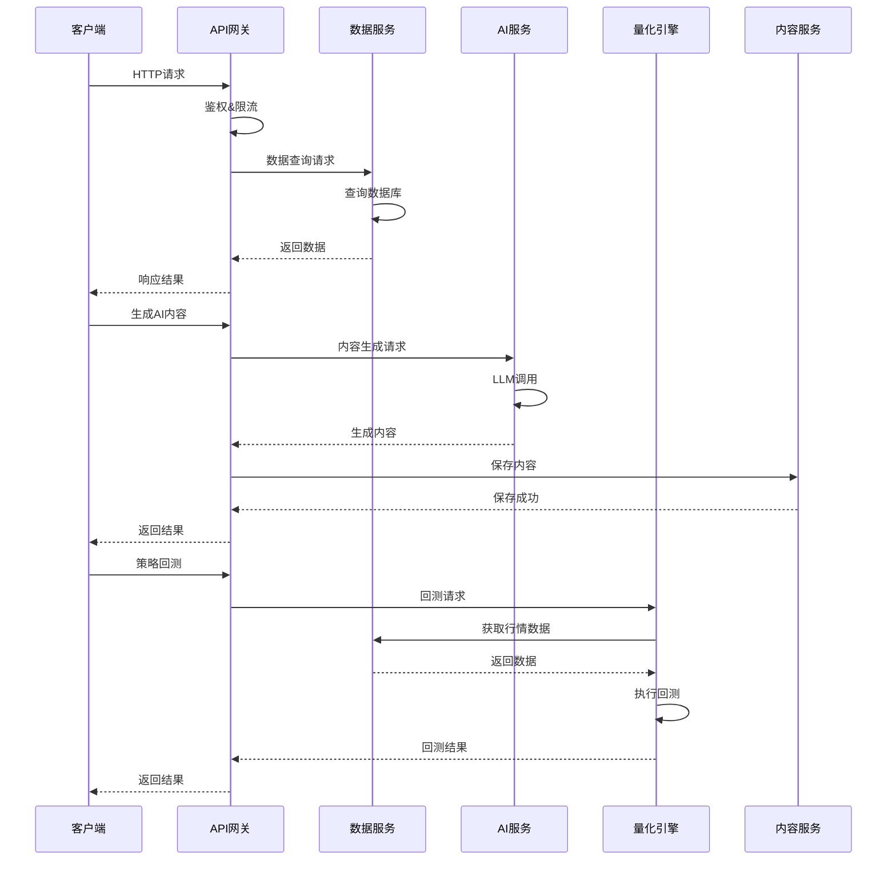
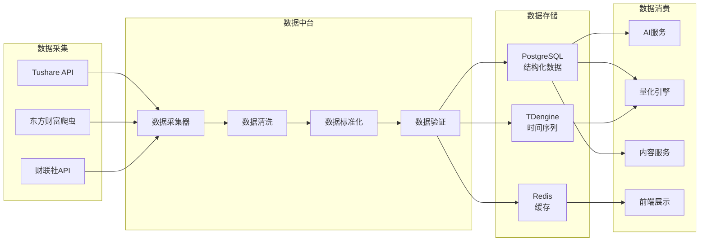
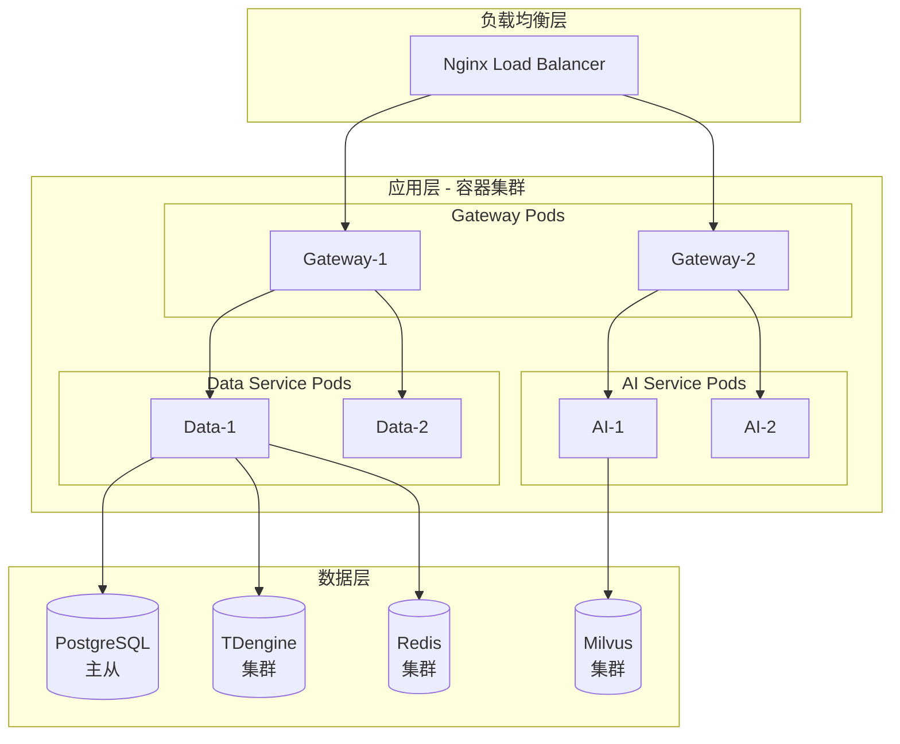
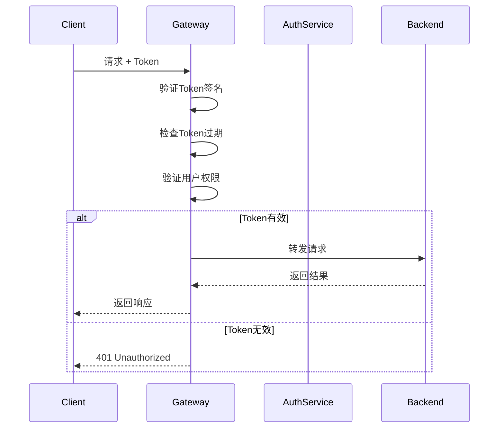
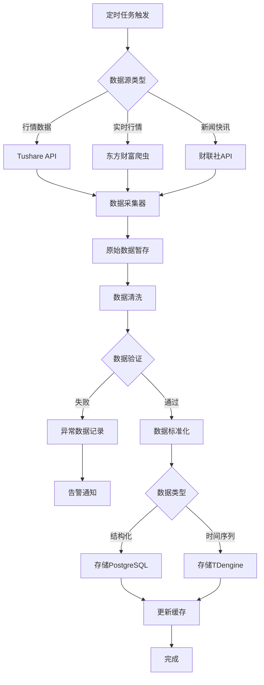
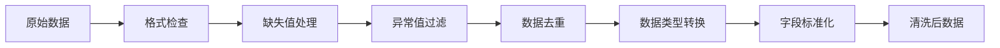
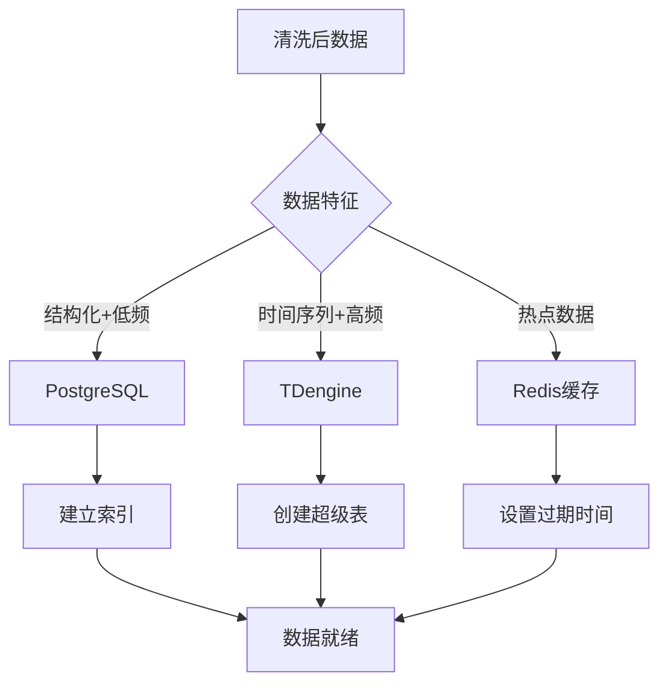
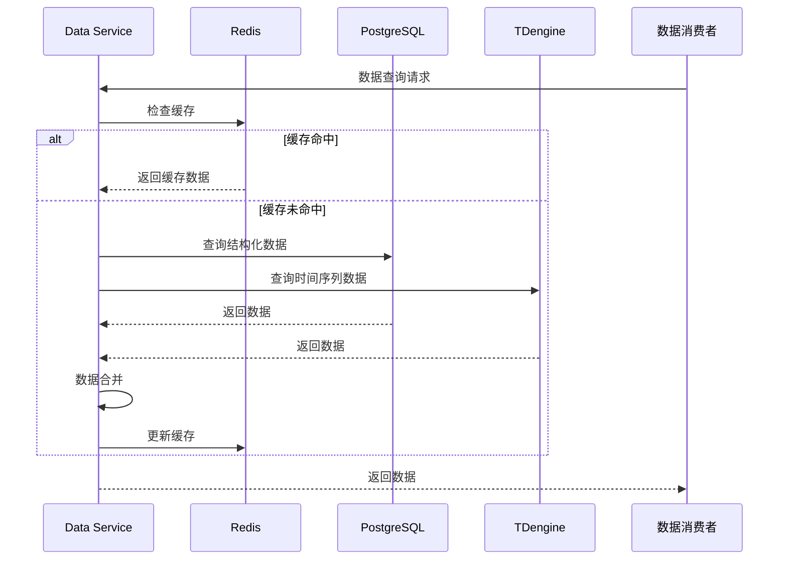
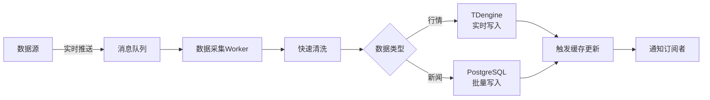

# 量化牛牛（QuantBull）技术架构设计文档

## 文档信息

- **文档版本**: v1.0.0
- **创建日期**: 2024-12
- **作者**: 架构团队
- **状态**: 正式版

## 目录

1. [系统架构图](#1-系统架构图)
2. [微服务划分](#2-微服务划分)
3. [数据库结构设计](#3-数据库结构设计)
4. [API网关流量设计](#4-api网关流量设计)
5. [服务职责详细说明](#5-服务职责详细说明)
6. [第三方依赖集成](#6-第三方依赖集成)
7. [数据中台数据流](#7-数据中台数据流)

---

## 1. 系统架构图

### 1.1 整体分层架构

#### Mermaid 架构图



#### ASCII 架构图

```
┌─────────────────────────────────────────────────────────────────┐
│                        前端层（用户端）                          │
│  ┌──────────┐  ┌──────────┐  ┌──────────┐                      │
│  │ Web H5   │  │微信小程序 │  │微信公众号 │                      │
│  │ Vue3+EP  │  │ Uni-app  │  │ 内容中心  │                      │
│  └────┬─────┘  └────┬─────┘  └────┬─────┘                      │
└───────┼─────────────┼─────────────┼────────────────────────────┘
        │             │             │
        └─────────────┴─────────────┘
                      │
        ┌─────────────▼─────────────┐
        │      API Gateway          │
        │   (FastAPI + 鉴权+限流)    │
        │     Port: 8000            │
        └─────────────┬─────────────┘
                      │
        ┌─────────────┼─────────────┬─────────────┐
        │             │             │             │
┌───────▼──────┐ ┌───▼──────┐ ┌───▼──────┐ ┌───▼──────┐
│ Data Service │ │AI Service│ │Quant     │ │Content   │
│ Port: 8001   │ │Port: 8002│ │Engine    │ │Service   │
│              │ │          │ │Port:8003 │ │Port:8004 │
└──────┬───────┘ └────┬─────┘ └────┬─────┘ └────┬─────┘
       │              │             │            │
       │    ┌─────────┴─────────────┘            │
       │    │                                    │
┌──────▼────▼────┐                   ┌───────────▼────────┐
│  AI能力层      │                   │   数据与基础设施层  │
│  - DeepSeek    │                   │  - PostgreSQL      │
│  - Qwen        │                   │  - TDengine        │
│  - 数字人API   │                   │  - Redis           │
│  - 本地模型    │                   │  - Milvus          │
└────────────────┘                   │  - OSS/S3          │
                                     └────────────────────┘
```

### 1.2 微服务交互图



### 1.3 数据流架构图



### 1.4 部署架构图



---

## 2. 微服务划分

### 2.1 Gateway Service（API网关）

**服务边界**:
- 统一对外API入口
- 不包含业务逻辑
- 仅负责路由、鉴权、限流

**核心职责**:
1. 请求路由转发
2. JWT鉴权认证
3. 接口限流控制
4. 服务熔断降级
5. 跨域处理
6. 请求日志记录

**技术栈**:
- FastAPI
- python-jose (JWT)
- httpx (服务调用)
- redis (限流计数器)

**端口配置**:
- HTTP: 8000
- 内部服务通信: 服务发现

**服务依赖**:
- Data Service (8001)
- AI Service (8002)
- Quant Engine (8003)
- Content Service (8004)

### 2.2 Data Service（数据中台）

**服务边界**:
- 所有数据采集、存储、查询
- 数据清洗和标准化
- 定时任务调度

**核心职责**:
1. 行情数据采集（Tushare、爬虫）
2. 新闻快讯采集（财联社）
3. 数据清洗和标准化
4. 数据存储（PostgreSQL、TDengine）
5. 数据查询API
6. 定时任务管理（Celery）

**技术栈**:
- FastAPI
- Scrapy / Playwright
- Celery
- SQLAlchemy
- psycopg2
- taos-connector (TDengine)

**端口配置**:
- HTTP: 8001
- Celery Worker: 内部

**数据存储**:
- PostgreSQL: 结构化数据（新闻、公司信息）
- TDengine: 时间序列数据（K线、实时行情）
- Redis: 缓存热点数据

### 2.3 AI Service（AI中台）

**服务边界**:
- LLM调用和路由
- Prompt工程管理
- AI内容生成
- 向量检索

**核心职责**:
1. LLM网关管理（DeepSeek、Qwen、本地模型）
2. Prompt模板管理
3. AI新闻生成
4. AI投资日刊生成
5. 策略代码生成（自然语言→代码）
6. 向量检索（Milvus）
7. 数字人脚本生成

**技术栈**:
- FastAPI
- OpenAI SDK (兼容DeepSeek)
- DashScope SDK (Qwen)
- pymilvus
- sentence-transformers
- langchain

**端口配置**:
- HTTP: 8002

**外部依赖**:
- DeepSeek API
- Qwen API
- Milvus向量数据库
- 本地模型服务（可选）

### 2.4 Quant Engine（量化引擎）

**服务边界**:
- 策略回测
- 因子计算
- 股票筛选
- 绩效分析

**核心职责**:
1. 策略回测引擎（Backtrader）
2. 技术指标计算
3. 多因子模型
4. 股票筛选器
5. ETF轮动策略
6. 绩效指标计算

**技术栈**:
- FastAPI
- Backtrader
- pandas
- numpy
- ta-lib
- scikit-learn

**端口配置**:
- HTTP: 8003

**数据依赖**:
- Data Service: 获取行情数据

### 2.5 Content Service（内容服务）

**服务边界**:
- 内容管理
- 内容审核
- 内容发布
- 公众号推送

**核心职责**:
1. 内容存储和管理
2. 内容审核（敏感词、合规性）
3. H5页面生成
4. 微信公众号推送
5. 视频资源管理
6. 内容统计分析

**技术栈**:
- FastAPI
- SQLAlchemy
- Jinja2 (模板引擎)
- wechatpy (微信SDK)
- boto3 / oss2 (对象存储)

**端口配置**:
- HTTP: 8004

**数据存储**:
- PostgreSQL: 内容元数据
- OSS/S3: 视频、图片文件

### 2.6 Frontend Web（Web前端）

**服务边界**:
- Web端用户界面
- 不包含后端业务逻辑

**核心职责**:
1. 用户仪表盘
2. 新闻内容展示
3. 量化实验室（策略编辑器）
4. 回测报告可视化
5. 投资日刊展示
6. 视频播放

**技术栈**:
- Vue 3
- Element Plus
- Vue Router
- Pinia
- ECharts
- Monaco Editor
- Axios

**部署方式**:
- 静态资源（Nginx）
- 或SSR（可选）

### 2.7 MiniApp（微信小程序）

**服务边界**:
- 小程序端用户界面
- 轻量级功能

**核心职责**:
1. 新闻浏览
2. 投资日刊阅读
3. 视频播放
4. 自选股管理
5. 内容分享

**技术栈**:
- Uni-app
- Vue 3
- Pinia

**部署方式**:
- 微信小程序平台

---

## 3. 数据库结构设计

详细数据库设计见: [数据库设计脚本](../design/database-schema.sql)

### 3.1 PostgreSQL 表结构概览

#### 核心表设计

1. **users** - 用户表
2. **news** - 新闻表
3. **articles** - 文章表
4. **daily_reports** - 投资日刊表
5. **strategies** - 策略表
6. **backtests** - 回测记录表
7. **companies** - 公司信息表
8. **videos** - 视频资源表

### 3.2 TDengine 表结构

1. **market_data** - 行情数据表
2. **kline_data** - K线数据表
3. **realtime_quotes** - 实时行情表

### 3.3 Redis 数据结构

1. **session:{user_id}** - 用户会话
2. **rate_limit:{ip}:{path}** - 限流计数器
3. **cache:news:{id}** - 新闻缓存
4. **cache:market:{code}** - 行情缓存

### 3.4 Milvus 集合设计

1. **news_vectors** - 新闻向量集合
2. **company_vectors** - 公司向量集合

---

## 4. API网关流量设计

### 4.1 路由规则配置

详细路由配置见: [网关路由配置](../design/gateway-routes.yaml)

#### 路由规则表

| 路径前缀 | 目标服务 | 鉴权要求 | 限流规则 | 说明 |
|---------|---------|---------|---------|------|
| `/api/v1/data/` | Data Service | 可选 | 1000/分钟 | 数据查询接口 |
| `/api/v1/ai/` | AI Service | 必需 | 100/分钟 | AI生成接口 |
| `/api/v1/quant/` | Quant Engine | 必需 | 50/分钟 | 量化计算接口 |
| `/api/v1/content/` | Content Service | 可选 | 500/分钟 | 内容查询接口 |
| `/api/v1/auth/` | Gateway | 无 | 100/分钟 | 认证接口 |

### 4.2 鉴权机制

#### JWT Token 结构

```json
{
  "header": {
    "alg": "HS256",
    "typ": "JWT"
  },
  "payload": {
    "user_id": "12345",
    "username": "user@example.com",
    "roles": ["user"],
    "exp": 1234567890,
    "iat": 1234567890
  }
}
```

#### 鉴权流程



### 4.3 限流策略

#### 限流规则

1. **基于IP限流**
   - 全局: 1000 请求/分钟
   - 单接口: 100 请求/分钟

2. **基于用户限流**
   - 普通用户: 100 请求/分钟
   - VIP用户: 1000 请求/分钟

3. **基于接口限流**
   - 数据查询: 1000/分钟
   - AI生成: 100/分钟
   - 回测计算: 50/分钟

#### 限流算法

- **令牌桶算法** (Token Bucket)
- 使用Redis实现分布式限流

### 4.4 熔断降级

#### 熔断规则

| 服务 | 失败率阈值 | 时间窗口 | 恢复时间 |
|------|-----------|---------|---------|
| Data Service | 50% | 60s | 30s |
| AI Service | 50% | 60s | 60s |
| Quant Engine | 50% | 60s | 30s |
| Content Service | 50% | 60s | 30s |

#### 降级策略

1. **AI服务降级**: 返回默认提示或缓存内容
2. **数据服务降级**: 返回缓存数据
3. **量化引擎降级**: 返回简化计算结果

### 4.5 请求转发规则

```yaml
路由匹配规则:
  1. 精确匹配 > 前缀匹配 > 通配符匹配
  2. 优先级从高到低
  3. 支持路径重写
  4. 支持请求头添加
```

### 4.6 跨域处理

```python
CORS配置:
  - 允许来源: * (生产环境需配置具体域名)
  - 允许方法: GET, POST, PUT, DELETE, OPTIONS
  - 允许头部: Authorization, Content-Type
  - 最大年龄: 3600秒
```

---

## 5. 服务职责详细说明

### 5.1 Gateway Service

#### 核心功能模块

1. **路由模块** (`app/routes/`)
   - 健康检查路由
   - 服务代理路由
   - 静态资源路由

2. **中间件模块** (`app/middleware/`)
   - 认证中间件 (`auth.py`)
   - 限流中间件 (`rate_limit.py`)
   - CORS中间件 (`cors.py`)
   - 日志中间件 (`logging.py`)

3. **工具模块** (`app/utils/`)
   - JWT工具
   - 响应格式化
   - 错误处理

#### API接口列表

| 接口 | 方法 | 说明 |
|-----|------|------|
| `/health` | GET | 健康检查 |
| `/api/v1/data/*` | ALL | 数据服务代理 |
| `/api/v1/ai/*` | ALL | AI服务代理 |
| `/api/v1/quant/*` | ALL | 量化引擎代理 |
| `/api/v1/content/*` | ALL | 内容服务代理 |
| `/api/v1/auth/login` | POST | 用户登录 |
| `/api/v1/auth/refresh` | POST | Token刷新 |

#### 数据模型

- 请求日志模型
- 限流计数器模型
- 服务健康状态模型

#### 依赖关系

```
Gateway
  ├── Data Service (数据查询)
  ├── AI Service (AI生成)
  ├── Quant Engine (量化计算)
  ├── Content Service (内容管理)
  └── Redis (限流、会话)
```

### 5.2 Data Service

#### 核心功能模块

1. **采集器模块** (`app/collectors/`)
   - Tushare采集器
   - 东方财富爬虫
   - 财联社API采集器
   - 采集器基类

2. **处理器模块** (`app/processors/`)
   - 数据清洗器
   - 数据标准化器
   - 数据验证器

3. **存储模块** (`app/storage/`)
   - PostgreSQL操作
   - TDengine操作
   - Redis缓存

4. **定时任务模块** (`app/tasks/`)
   - 行情数据采集任务
   - 新闻采集任务
   - 数据清洗任务

#### API接口列表

| 接口 | 方法 | 说明 |
|-----|------|------|
| `/api/v1/market/quotes` | GET | 获取行情数据 |
| `/api/v1/market/kline` | GET | 获取K线数据 |
| `/api/v1/news/list` | GET | 获取新闻列表 |
| `/api/v1/news/{id}` | GET | 获取新闻详情 |
| `/api/v1/etf/list` | GET | 获取ETF列表 |
| `/api/v1/companies/{code}` | GET | 获取公司信息 |

#### 数据模型

- 行情数据模型
- 新闻数据模型
- ETF数据模型
- 公司信息模型

#### 依赖关系

```
Data Service
  ├── PostgreSQL (结构化数据)
  ├── TDengine (时间序列数据)
  ├── Redis (缓存)
  ├── Celery (任务队列)
  └── 外部数据源
      ├── Tushare
      ├── 东方财富
      └── 财联社
```

### 5.3 AI Service

#### 核心功能模块

1. **LLM网关模块** (`app/llm/`)
   - 网关主逻辑
   - 提供商适配器（DeepSeek、Qwen、本地）
   - 智能路由策略

2. **Prompt管理模块** (`app/prompts/`)
   - Prompt管理器
   - Prompt模板库
   - Prompt注册表

3. **生成器模块** (`app/generators/`)
   - 新闻生成器
   - 策略代码生成器
   - 投资日刊生成器
   - 公司介绍生成器
   - 视频脚本生成器

4. **向量检索模块** (`app/vector/`)
   - Milvus客户端
   - 嵌入向量生成

#### API接口列表

| 接口 | 方法 | 说明 |
|-----|------|------|
| `/api/v1/generate/news` | POST | 生成新闻 |
| `/api/v1/generate/strategy` | POST | 生成策略代码 |
| `/api/v1/generate/daily-report` | POST | 生成投资日刊 |
| `/api/v1/generate/company-intro` | POST | 生成公司介绍 |
| `/api/v1/generate/video-script` | POST | 生成视频脚本 |
| `/api/v1/prompts` | GET | 获取Prompt模板 |

#### 数据模型

- Prompt模板模型
- 生成任务模型
- 向量集合模型

#### 依赖关系

```
AI Service
  ├── Milvus (向量检索)
  ├── Redis (缓存)
  └── 外部LLM服务
      ├── DeepSeek API
      ├── Qwen API
      └── 本地模型服务
```

### 5.4 Quant Engine

#### 核心功能模块

1. **回测模块** (`app/backtest/`)
   - 回测引擎
   - 模拟经纪商
   - 策略基类
   - 回测分析器

2. **策略模块** (`app/strategies/`)
   - 技术指标策略
   - 因子策略
   - ETF轮动策略

3. **因子模块** (`app/factors/`)
   - 技术因子
   - 基本面因子
   - 情绪因子

4. **选股器模块** (`app/selectors/`)
   - 股票筛选器
   - ETF筛选器

#### API接口列表

| 接口 | 方法 | 说明 |
|-----|------|------|
| `/api/v1/backtest/run` | POST | 运行回测 |
| `/api/v1/backtest/{id}` | GET | 获取回测结果 |
| `/api/v1/strategies` | GET | 获取策略列表 |
| `/api/v1/strategies/{id}` | GET | 获取策略详情 |
| `/api/v1/factors/calculate` | POST | 计算因子 |
| `/api/v1/selectors/stocks` | POST | 股票筛选 |
| `/api/v1/selectors/etf` | POST | ETF筛选 |

#### 数据模型

- 策略模型
- 回测记录模型
- 因子模型
- 绩效指标模型

#### 依赖关系

```
Quant Engine
  └── Data Service (获取行情数据)
```

### 5.5 Content Service

#### 核心功能模块

1. **内容管理模块** (`app/services/content.py`)
   - 内容CRUD
   - 内容审核
   - 内容发布

2. **微信服务模块** (`app/services/wechat.py`)
   - 公众号推送
   - 模板消息
   - 多图文生成

3. **存储服务模块** (`app/services/storage.py`)
   - OSS上传
   - 文件管理

#### API接口列表

| 接口 | 方法 | 说明 |
|-----|------|------|
| `/api/v1/articles` | GET/POST | 文章列表/创建 |
| `/api/v1/articles/{id}` | GET/PUT/DELETE | 文章详情/更新/删除 |
| `/api/v1/daily-reports` | GET/POST | 投资日刊列表/创建 |
| `/api/v1/videos` | GET/POST | 视频列表/上传 |
| `/api/v1/h5/{type}/{id}` | GET | H5页面 |
| `/api/v1/wechat/push` | POST | 微信推送 |

#### 数据模型

- 文章模型
- 投资日刊模型
- 视频模型
- 推送记录模型

#### 依赖关系

```
Content Service
  ├── PostgreSQL (内容元数据)
  ├── OSS/S3 (文件存储)
  └── 微信公众号API
```

---

## 6. 第三方依赖集成

### 6.1 DeepSeek API

#### 集成方式

- 使用OpenAI兼容SDK
- RESTful API调用
- 异步请求处理

#### 配置参数

```python
DEEPSEEK_CONFIG = {
    "api_key": "sk-xxx",
    "base_url": "https://api.deepseek.com/v1",
    "model": "deepseek-chat",
    "timeout": 60,
    "max_retries": 3
}
```

#### 错误处理

- 网络超时: 重试3次，指数退避
- API限流: 返回429错误，等待后重试
- 认证失败: 返回401错误，记录日志

#### 降级方案

- 降级到Qwen API
- 或返回缓存结果
- 或使用本地模型

### 6.2 Qwen API

#### 集成方式

- 使用DashScope SDK
- 兼容OpenAI格式
- 支持流式响应

#### 配置参数

```python
QWEN_CONFIG = {
    "api_key": "sk-xxx",
    "base_url": "https://dashscope.aliyuncs.com/compatible-mode/v1",
    "model": "qwen-turbo",
    "timeout": 60,
    "max_retries": 3
}
```

#### 错误处理

- 同DeepSeek处理逻辑
- 支持错误码映射

#### 降级方案

- 降级到DeepSeek
- 或使用本地模型

### 6.3 数字人API（硅基/腾讯智影）

#### 集成方式

- 第三方HTTP API调用
- 支持异步任务处理

#### 配置参数

```python
DIGITAL_HUMAN_CONFIG = {
    "provider": "silicone",  # 或 "tencent"
    "api_key": "xxx",
    "api_secret": "xxx",
    "base_url": "https://api.silicone.com",
    "timeout": 300,  # 视频生成耗时较长
    "callback_url": "https://api.quantbull.com/webhook/video"
}
```

#### 错误处理

- 超时处理: 任务异步处理，通过回调通知
- 失败重试: 最多重试2次

#### 降级方案

- 降级到文字版内容
- 或使用预生成视频

### 6.4 Tushare数据源

#### 集成方式

- 使用Tushare Python SDK
- 需要Token认证
- 支持Pro版本

#### 配置参数

```python
TUSHARE_CONFIG = {
    "token": "your-tushare-token",
    "pro_api": "https://tushare.pro/api",
    "timeout": 30,
    "retry_times": 3
}
```

#### 错误处理

- 积分不足: 记录日志，使用备用数据源
- 请求限流: 使用队列排队请求
- 数据缺失: 标记并记录

#### 降级方案

- 降级到爬虫数据源
- 或返回缓存数据

### 6.5 东方财富爬虫

#### 集成方式

- 使用Playwright/Scrapy
- 动态页面渲染
- 反爬虫处理

#### 配置参数

```python
EASTMONEY_CONFIG = {
    "base_url": "http://quote.eastmoney.com",
    "headers": {
        "User-Agent": "Mozilla/5.0..."
    },
    "retry_times": 3,
    "delay": 1  # 请求延迟，避免被封
}
```

#### 错误处理

- IP封禁: 使用代理池
- 页面结构变化: 自动适配或告警
- 超时: 重试机制

#### 降级方案

- 降级到Tushare数据
- 或使用其他数据源

### 6.6 财联社API

#### 集成方式

- RESTful API调用
- 实时推送（WebSocket可选）

#### 配置参数

```python
CLS_CONFIG = {
    "api_key": "xxx",
    "base_url": "https://api.cls.cn",
    "timeout": 30,
    "websocket_url": "wss://push.cls.cn"
}
```

#### 错误处理

- 认证失败: 刷新Token
- 推送中断: 自动重连

### 6.7 OSS对象存储

#### 集成方式

- 支持阿里云OSS、AWS S3
- 使用boto3/oss2 SDK
- 支持分片上传

#### 配置参数

```python
OSS_CONFIG = {
    "provider": "aliyun",  # 或 "aws"
    "endpoint": "oss-cn-beijing.aliyuncs.com",
    "access_key": "xxx",
    "secret_key": "xxx",
    "bucket": "quantbull-media",
    "cdn_domain": "https://cdn.quantbull.com"
}
```

#### 错误处理

- 上传失败: 重试机制
- 存储空间不足: 告警通知

---

## 7. 数据中台数据流

### 7.1 数据采集流程



### 7.2 数据清洗流程



#### 清洗规则

1. **行情数据清洗**
   - 过滤停牌、退市股票
   - 修正异常价格（涨跌停、除权除息）
   - 补齐缺失K线数据

2. **新闻数据清洗**
   - 去除HTML标签
   - 提取正文内容
   - 识别关联股票代码
   - 情感分析标记

3. **公司数据清洗**
   - 统一股票代码格式
   - 标准化行业分类
   - 规范化财务指标单位

### 7.3 数据存储流程



#### 存储策略

**PostgreSQL存储**:
- 新闻、文章（全文检索索引）
- 公司信息（关系型数据）
- 用户数据
- 策略配置

**TDengine存储**:
- 1分钟K线数据（超级表按股票代码分表）
- 实时行情（高频写入）
- 历史行情（长期存储）

**Redis缓存**:
- 热点新闻（TTL: 1小时）
- 实时行情（TTL: 1分钟）
- 用户会话（TTL: 24小时）

### 7.4 数据分发流程



### 7.5 定时任务调度

#### Celery任务配置

```python
CELERY_BEAT_SCHEDULE = {
    # 行情数据采集（交易时间每分钟）
    'collect-market-data': {
        'task': 'tasks.market.collect_realtime_quotes',
        'schedule': crontab(minute='*/1', hour='9-15'),  # 9:00-15:00
    },
    
    # K线数据采集（收盘后）
    'collect-kline-data': {
        'task': 'tasks.market.collect_daily_kline',
        'schedule': crontab(hour=16, minute=0),  # 16:00
    },
    
    # 新闻快讯采集（实时）
    'collect-news-flash': {
        'task': 'tasks.news.collect_cls_flash',
        'schedule': crontab(minute='*/5'),  # 每5分钟
    },
    
    # 数据清洗任务（每小时）
    'clean-data': {
        'task': 'tasks.processors.clean_raw_data',
        'schedule': crontab(minute=0),  # 每小时整点
    },
}
```

#### 任务优先级

1. **高优先级**: 实时行情采集
2. **中优先级**: 新闻快讯采集
3. **低优先级**: 数据清洗、归档

### 7.6 实时数据流



#### 实时数据处理

- **WebSocket推送**: 实时行情推送到前端
- **事件通知**: 重要新闻事件通知AI服务
- **流式处理**: 使用Kafka/RabbitMQ（可选）

---

## 8. 附录

### 8.1 技术栈汇总

| 层级 | 技术选型 | 版本 |
|-----|---------|------|
| 后端框架 | FastAPI | 0.104+ |
| 编程语言 | Python | 3.11+ |
| 数据库 | PostgreSQL | 15+ |
| 时序数据库 | TDengine | 3.0+ |
| 缓存 | Redis | 7+ |
| 向量数据库 | Milvus | 2.3+ |
| 任务队列 | Celery | 5.3+ |
| 前端框架 | Vue | 3.4+ |
| 小程序框架 | Uni-app | 3.0+ |
| 容器化 | Docker | 20+ |

### 8.2 服务端口汇总

| 服务 | 端口 | 协议 |
|-----|------|------|
| Gateway | 8000 | HTTP |
| Data Service | 8001 | HTTP |
| AI Service | 8002 | HTTP |
| Quant Engine | 8003 | HTTP |
| Content Service | 8004 | HTTP |
| PostgreSQL | 5432 | TCP |
| Redis | 6379 | TCP |
| Milvus | 19530 | TCP |
| TDengine | 6030 | TCP |

### 8.3 参考资料

- [FastAPI文档](https://fastapi.tiangolo.com/)
- [TDengine文档](https://docs.taosdata.com/)
- [Milvus文档](https://milvus.io/docs)
- [Backtrader文档](https://www.backtrader.com/)

---

**文档结束**

